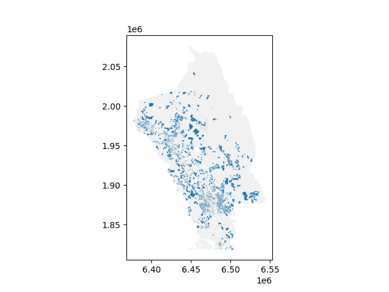

# Initial Python setup

```shell
python3 -m venv venv
source venv/bin/activate
python3 -m pip install --upgrade pip
pip install -r requirements.txt
```

# Initial data setup

```shell
wget http://gis.napa.ca.gov/data/boundaries/parcels_public.zip -P ~/Downloads
mkdir ~/Downloads/parcels_public/
unzip -d ~/Downloads/parcels_public/ ~/Downloads/parcels_public.zip
```

# Converting data to Parquet
From within your virtualenv (see "Initial Python setup"):

```shell
python import.py '~/Downloads/parcels_public/'
```

This produces a napa_public_parcels.parquet file

# Analyzing the Parquet data
From within your virtualenv (see "Initial Python setup"):

```shell
python analyze.py
```

This prints out the output of some basic queries and, just for fun, prints a map of single family residences that looks like this:


